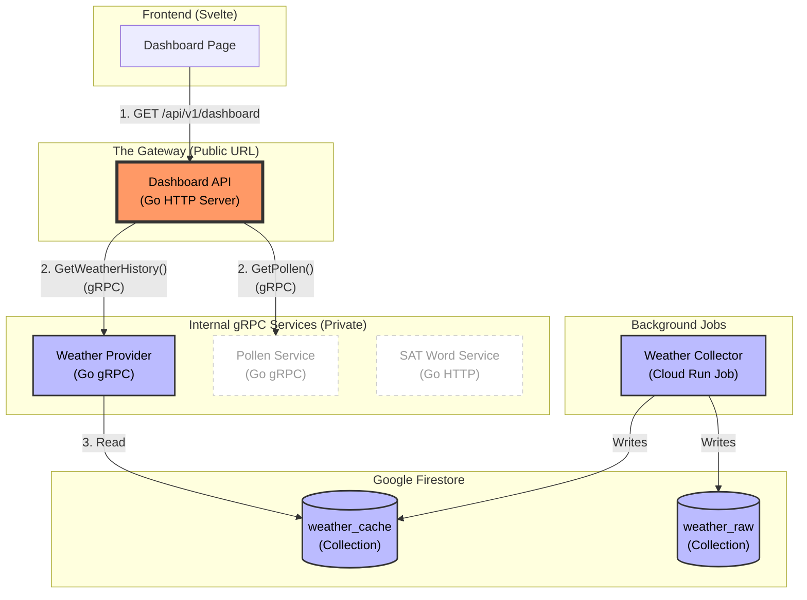

# Infrastructure & Platform Architecture

## 1. System Architecture Diagram



## 2. Overview
The Personal Dashboard platform is designed as a **Multi-Cloud System**, with completely isolated deployments for Google Cloud Platform (GCP) and Amazon Web Services (AWS). This allows for side-by-side comparison of costs, performance, and developer experience.

## 3. Multi-Cloud Strategy
We use Terraform to manage two distinct, non-overlapping stacks.

### Folder Structure
```text
infra/
├── gcp/         # The Google Cloud Platform stack
│   ├── main.tf
│   ├── firestore.tf
│   └── ...
└── aws/         # The Amazon Web Services stack (Future)
    ├── main.tf
    ├── dynamo.tf
    └── ...
```

### Identity & Authentication
We use an **Abstraction Layer** to support both clouds without changing backend code.
*   **GCP:** Google Identity Platform (Firebase Auth).
*   **AWS:** Amazon Cognito.
*   **Backend Protocol:** OpenID Connect (OIDC). The backend services validate JWTs based on the `ISSUER_URL` environment variable, agnostic of the actual provider.
*   **Frontend Strategy:** The "Adapter Pattern". The frontend loads the appropriate auth SDK (Firebase vs Amplify) based on build-time configuration.

## 4. Deployment Strategy (Bootstrap + CD)
We utilize a hybrid pattern to support both Disaster Recovery (DR) and fast Continuous Deployment (CD).

### Terraform (The Stage & Bootstrap)
*   **Role**: Manages infrastructure (IAM, APIs, Schedule, Memory limits).
*   **Behavior**:
    *   On a fresh install (DR), Terraform ensures a "Bootstrap" image exists.
    *   It creates Cloud Run Jobs/Services pointing to this image.
    *   **Crucial Config**: Resources use `lifecycle { ignore_changes = [image] }`. This tells Terraform to **not revert** the image version if it detects a change.

### GitHub Actions (The Actor)
*   **Role**: Manages day-to-day code deployments.
*   **Behavior**:
    *   **CI (Verify):** On Pull Request, runs unit tests (`go test`) and build checks.
    *   **CD (Deploy):** On push to `main`, builds the new Docker image (tagged with `git sha`), pushes to Artifact Registry, and updates the Cloud Run resource.

## 5. Data Layer (GCP Implementation)
Defined in `infra/gcp/firestore.tf`.

*   **Firestore (Native Mode):** The primary database.
*   **Database ID:** `weather-log` (Note: separate from the `(default)` database).
*   **Access Pattern:** Services connect using the Google Cloud Go SDK, authenticated via their runtime Service Account.

## 6. Development Workflow
*   **Local:** Developers use `go run` or `make` commands.
*   **Testing:** Automated CI workflows (`verify-*.yml`) run on every Pull Request.
*   **Production:** Automated CD workflows (`deploy-*.yml`) run on merge to `main`.
