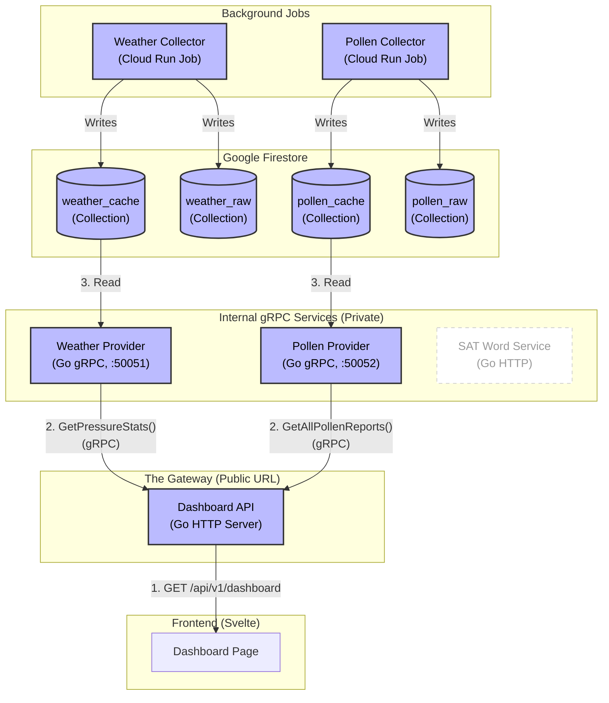

# Infrastructure & Platform Architecture

## 1. System Architecture Diagram


```mermaid
flowchart TD
    subgraph Frontend ["Frontend (Svelte)"]
        direction TB
        UI_Dash[Dashboard Page]
    end

    subgraph Aggregator ["The Gateway (Public URL)"]
        direction TB
        S_Dash["Dashboard API<br/>(Go HTTP Server)"]:::done
    end

    subgraph Microservices ["Internal gRPC Services (Private)"]
        direction TB
        S_Weath["Weather Provider<br/>(Go gRPC, :50051)"]:::done
        S_Poll["Pollen Provider<br/>(Go gRPC, :50052)"]:::done
        S_Sat["SAT Word Service<br/>(Go HTTP)"]:::future
    end

    subgraph Background ["Background Jobs"]
        direction TB
        J_Weath["Weather Collector<br/>(Cloud Run Job)"]:::done
        J_Poll["Pollen Collector<br/>(Cloud Run Job)"]:::done
    end

    subgraph Data ["Google Firestore"]
        direction TB
        DB_Weath[("weather_cache<br/>(Collection)")]:::done
        DB_Raw[("weather_raw<br/>(Collection)")]:::done
        DB_PolCache[("pollen_cache<br/>(Collection)")]:::done
        DB_PolRaw[("pollen_raw<br/>(Collection)")]:::done
    end

    %% Data Flow (arrows follow data direction)
    DB_Weath -- "3. Read" --> S_Weath
    DB_PolCache -- "3. Read" --> S_Poll

    S_Weath -- "2. GetPressureStats()<br/>(gRPC)" --> S_Dash
    S_Poll -- "2. GetAllPollenReports()<br/>(gRPC)" --> S_Dash

    S_Dash -- "1. GET /api/v1/dashboard" --> UI_Dash

    J_Weath -- "Writes" --> DB_Weath
    J_Weath -- "Writes" --> DB_Raw
    J_Poll -- "Writes" --> DB_PolCache
    J_Poll -- "Writes" --> DB_PolRaw

    %% Styling
    classDef done fill:#bbf,stroke:#333,stroke-width:2px,color:black;
    classDef future fill:#fff,stroke:#ccc,stroke-width:1px,color:#999,stroke-dasharray: 5 5;
```

## 2. Overview
The Personal Dashboard platform runs on **Google Cloud Platform (GCP)**, managed by Terraform with a modular structure supporting staging and production environments.

## 3. Infrastructure Structure
Terraform modules in `infra/modules/` define reusable resource configurations. Each environment (`infra/staging/`, `infra/prod/`) calls these modules with environment-specific values.

### Folder Structure
```text
infra/
  modules/          # Shared Terraform modules
    foundation/     # API enables + Artifact Registry
    firestore/      # Firestore databases
    secrets/        # Secret Manager secrets
    cloud-run-job/  # Collector jobs + Scheduler
    cloud-run-provider/   # Internal gRPC services
    cloud-run-aggregator/ # Public BFF
    cloud-run-domain-mapping/ # Custom domain mapping for Cloud Run services
    github-oidc/    # GitHub Actions OIDC
  staging/          # Staging environment (deployed on push to main)
  prod/             # Production environment (deployed on release creation)
```

### Environments
- **Staging:** Auto-deploys when code is merged to `main`. Uses `fang-gcp-staging` project.
- **Production:** Deploys when a GitHub release is created. Uses `fang-gcp` project.
- **Local:** Docker Compose + native Go for development (see Developer Guide).

## 4. Custom Domain Mapping

The staging Dashboard API is mapped to a custom subdomain (`api-staging.<domain>`) using Cloud Run domain mappings, managed by the `cloud-run-domain-mapping` Terraform module.

- **How it works:** The module creates a `google_cloud_run_domain_mapping` resource that associates the custom domain with the Cloud Run service. Google automatically provisions and renews a managed TLS certificate.
- **DNS:** A CNAME record at the domain registrar points the subdomain to `ghs.googlehosted.com.`. DNS is managed manually at the registrar, not in Terraform.
- **Prerequisite:** The domain must be verified via [Google Webmaster Central](https://www.google.com/webmasters/verification/verification?domain=yourdomain.com) before domain mappings can be created. This is a one-time step per root domain.

## 5. Deployment Strategy (Bootstrap + CD)
We utilize a hybrid pattern to support both Disaster Recovery (DR) and fast Continuous Deployment (CD).

### Terraform (The Stage & Bootstrap)
*   **Role**: Manages infrastructure (IAM, APIs, Schedule, Memory limits).
*   **Behavior**:
    *   On a fresh install (DR), Terraform ensures a "Bootstrap" image exists.
    *   It creates Cloud Run Jobs/Services pointing to this image.
    *   **Crucial Config**: Resources use `lifecycle { ignore_changes = [image] }`. This tells Terraform to **not revert** the image version if it detects a change.

### GitHub Actions (The Actor)
*   **Role**: Manages day-to-day code deployments.
*   **Behavior**:
    *   **CI (Verify):** On Pull Request, runs unit tests (`go test`) and build checks.
    *   **CD (Deploy):** Uses reusable workflow template (`.github/workflows/_deploy-service.yml`). Staging deploys trigger on push to `main`. Production deploys trigger on release creation. Both build a Docker image tagged with the git SHA, push to Artifact Registry, and update Cloud Run.

## 6. Data Layer (GCP Implementation)
Defined in `infra/modules/firestore/`.

*   **Firestore (Native Mode):** The primary database.
*   **Databases:** `weather-log` and `pollen-log` (Note: separate from the `(default)` database).
*   **Access Pattern:** Services connect using the Google Cloud Go SDK, authenticated via their runtime Service Account.

## 7. Development Workflow
*   **Local:** Developers use `go run` or `make` commands.
*   **Testing:** Automated CI workflows (`verify-*.yml`) run on every Pull Request.
*   **Staging:** Automated CD workflows (`deploy-*-staging.yml`) run on merge to `main`.
*   **Production:** Automated CD workflows (`deploy-*-prod.yml`) run on release creation.
