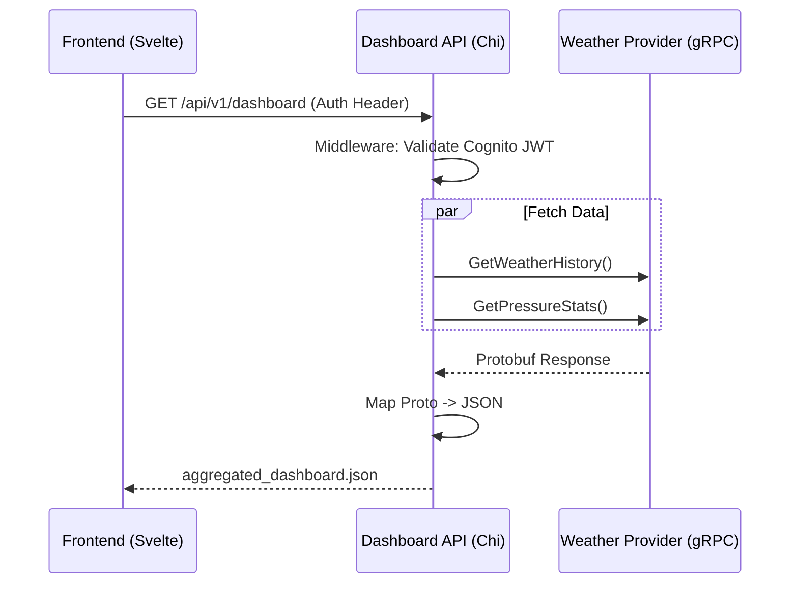

# Dashboard API Service Architecture

## 1. Overview
The **Dashboard API** (`services/dashboard-api`) is the **Backend-for-Frontend (BFF)**. It exposes a public REST HTTP API that aggregates data from various internal gRPC services (Weather, Pollen, etc.) to power the Personal Dashboard frontend.

## 2. Requirements

### Functional Requirements
*   **Aggregation:** Fetch data from `weather-provider` (gRPC) and future services in parallel.
*   **Translation:** Convert internal gRPC binary structures into frontend-friendly JSON.
*   **Authentication:** Validate AWS Cognito JWTs from the frontend.
*   **CORS:** Handle Cross-Origin requests from the Svelte app.

### Technical Stack
*   **Language:** Go 1.25
*   **HTTP Router:** `go-chi/chi` (Lightweight, idiomatic).
*   **RPC Client:** Native `google.golang.org/grpc`.
*   **Contract Management:** **Buf** (Linting & Code Generation).
*   **Concurrency:** `golang.org/x/sync/errgroup` for parallel service calls.

## 3. Architecture & Data Flow



## 4. Implementation Strategy

### Folder Structure
```text
services/dashboard-api/
├── main.go                # Entry point (Root)
├── internal/
│   ├── app/               # Router & Server setup
│   ├── handlers/          # HTTP Handlers (Controllers)
│   ├── middleware/        # Auth & Logging middleware
│   └── clients/           # gRPC Client wrappers
├── go.mod
└── Dockerfile
```

### API Design Principles
*   **Data API:** The API returns raw data with full precision (e.g., `1013.25482910`). Formatting (rounding, units) is the responsibility of the Frontend.
*   **Aggregation:** The API aggregates data from multiple sources into a single JSON response, keyed by domain (e.g., `"pressure"`, `"pollen"`).

### Dependency Management
*   **Contract First:** We use **Buf** to manage Protobuf files in `services/protos`.
*   **Shared Contracts:** This service imports gRPC client stubs from the centralized `services/gen/go` module.
*   **Build Strategy:** Docker builds are executed from the **repository root** context to allow copying the shared `gen/` directory.

---

## 5. Shared Library Structure (`services/gen/go`)
All services in the monorepo utilize this shared Go module for gRPC contracts.

```text
services/gen/go/
├── go.mod
├── weather/v1/   # Imported by Weather Provider & Dashboard API
└── pollen/v1/    # Imported by Pollen Service & Dashboard API
```

## 6. Architectural Decisions

### ADR-001: Shared Code Generation Strategy
*   **Context:** We have multiple services (Providers) and one Aggregator (Dashboard API) that need access to the same gRPC contracts.
*   **Decision:** We use a **Shared Gen Module** (`services/gen/go`) rather than generating code into every service individually.
*   **Rationale:**
    1.  **Single Source of Truth:** Eliminates "Schema Drift" between client and server code.
    2.  **Maintenance:** Adding a new service requires updating one Buf config, not scaffolding new make targets.
    3.  **Docker Trade-off:** Requires running `docker build` from the repository root, but simplifies the Dockerfiles themselves (standard `COPY`).
    4.  **Security:** Copying all generated code to all containers is acceptable as internal API schemas are not sensitive secrets.

## 7. Future Considerations

### 7.1. Pollen Service Integration
*   **Purpose:** Provide daily pollen counts/risk levels.
*   **Architecture:**
    *   **Pollen Collector:** A separate Go service (similar to `weather-collector`) or an extension of the current collector.
    *   **Storage:** Data will be stored in Firestore, potentially in a dedicated `pollen` collection.
    *   **Frequency:** Unlike pressure data (hourly), pollen data is typically measured once per day.
    *   **Terraform:** Cloud Scheduler will be updated to trigger the Pollen Collector on a daily cron schedule (e.g., `0 6 * * *`), separate from the hourly weather job.
*   **Dashboard Aggregation:** The Dashboard API will call the future `pollen-service` (gRPC) and merge the result under a `pollen` key.

### 7.2. Data Source Refinement
*   **Current State:** The API currently pulls only "Pressure" statistics from the `weather-provider` cache.
*   **Refinement:** Future iterations may fetch additional weather metrics (Temperature, Humidity, etc.) from external APIs via the `weather-provider` to provide a complete weather snapshot.

## 8. Development Plan
1.  **Scaffold:** Create directory structure and `go.mod`.
2.  **Code Generation:** Update `Makefile` to generate `weather_provider.proto` into `services/dashboard-api/gen/weather/v1`.
3.  **Router:** Set up `chi` with basic middleware.
4.  **gRPC Client:** Implement the connection to `weather-provider`.
    *   *Note:* Must support `insecure` (local) and `system-cert` (Cloud Run) credentials.
5.  **Handler:** Create the aggregation logic.
