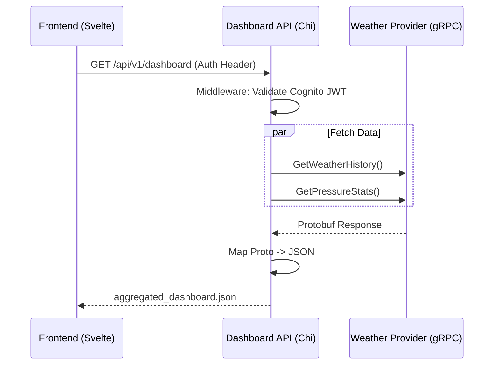

# Dashboard API Service Architecture

## 1. Overview
The **Dashboard API** (`services/dashboard-api`) is the **Backend-for-Frontend (BFF)**. It exposes a public REST HTTP API that aggregates data from various internal gRPC services (Weather, Pollen, etc.) to power the Personal Dashboard frontend.

## 2. Requirements

### Functional Requirements
*   **Aggregation:** Fetch data from `weather-provider` (gRPC) and future services in parallel.
*   **Translation:** Convert internal gRPC binary structures into frontend-friendly JSON.
*   **Authentication:** Validate AWS Cognito JWTs from the frontend.
*   **CORS:** Handle Cross-Origin requests from the Svelte app.

### Technical Stack
*   **Language:** Go 1.25
*   **HTTP Router:** `go-chi/chi` (Lightweight, idiomatic).
*   **RPC Client:** Native `google.golang.org/grpc`.
*   **Contract Management:** **Buf** (Linting & Code Generation).
*   **Concurrency:** `golang.org/x/sync/errgroup` for parallel service calls.

## 3. Architecture & Data Flow



## 4. Implementation Strategy

### Folder Structure
```text
services/dashboard-api/
├── main.go                # Entry point (Root)
├── internal/
│   ├── app/               # Router & Server setup
│   ├── handlers/          # HTTP Handlers (Controllers)
│   ├── middleware/        # Auth & Logging middleware
│   ├── clients/           # gRPC Client wrappers
│   └── gen/               # Local generated gRPC stubs
├── go.mod
└── Dockerfile
```

### API Design Principles
*   **Data API:** The API returns raw data with full precision (e.g., `1013.25482910`). Formatting (rounding, units) is the responsibility of the Frontend.
*   **Aggregation:** The API aggregates data from multiple sources into a single JSON response, keyed by domain (e.g., `"pressure"`, `"pollen"`).

### Dependency Management
*   **Contract First:** We use **Buf** to manage Protobuf files in `services/protos`.
*   **Distributed Contracts:** Code is generated directly into each service's `internal/gen` directory. This ensures each service is self-contained and has no external local dependencies during build time.
*   **Build Strategy:** Docker builds are executed within the **service directory** context. No access to the repository root or shared modules is required.

---

## 5. Architectural Decisions

### ADR-001: Distributed Code Generation Strategy
*   **Context:** We have multiple services (Providers) and one Aggregator (Dashboard API) that need access to the same gRPC contracts.
*   **Decision:** We use **Distributed Generation** (code lives in `internal/gen` of each service) rather than a shared Go module.
*   **Rationale:**
    1.  **Isolation:** Services are fully decoupled at build time. A service can be built and deployed without knowledge of other folders in the monorepo.
    2.  **Simple Docker:** Dockerfiles use standard `COPY . .` patterns. No complex context mounting or root-level builds are needed.
    3.  **Contract Integrity:** While the code is duplicated, the *source* (Protos) is centralized. Buf ensures that all services generate code from the same contract version.

## 6. Future Considerations

### 6.1. Pollen Service Integration
*   **Purpose:** Provide daily pollen counts/risk levels.
*   **Architecture:** Documented in `docs/ARCHITECTURE_SERVICE_POLLEN.md`.

## 7. Development Plan
1.  **Scaffold:** Create directory structure and `go.mod`.
2.  **Code Generation:** Configure Buf to output to `internal/gen`.
3.  **Router:** Set up `chi` with basic middleware.
4.  **gRPC Client:** Implement the connection to `weather-provider`.
5.  **Handler:** Create the aggregation logic.
