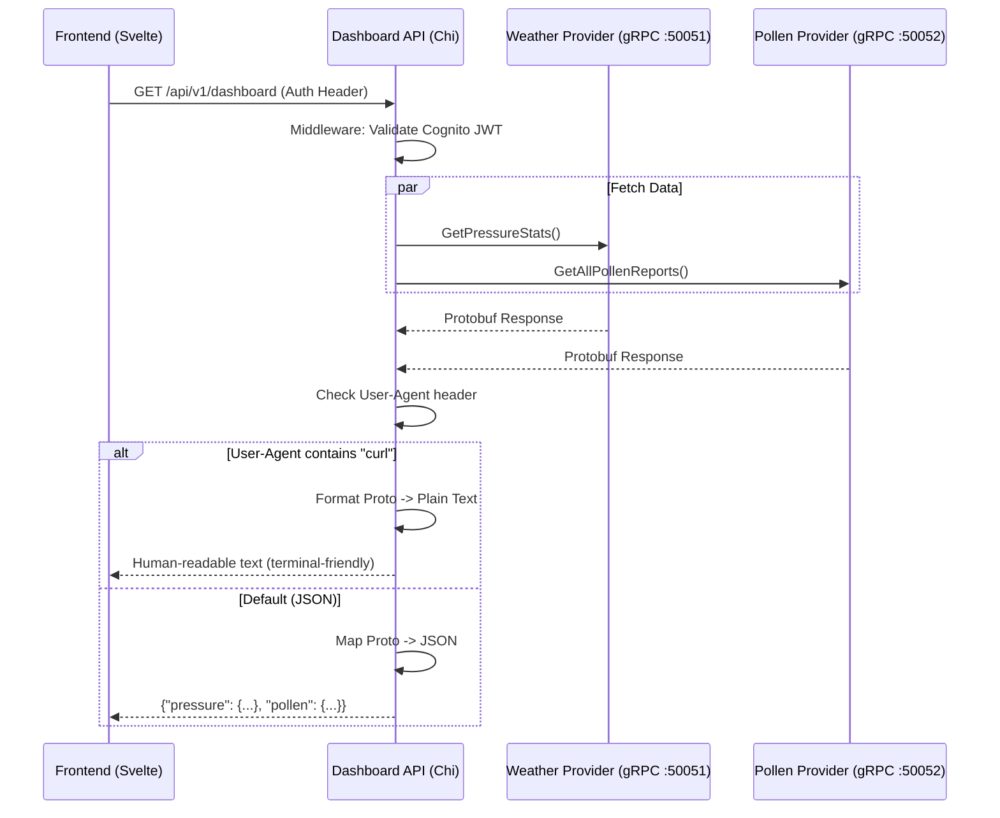

# Dashboard API Service Architecture

## 1. Overview
The **Dashboard API** (`services/dashboard-api`) is the **Backend-for-Frontend (BFF)**. It exposes a public REST HTTP API that aggregates data from various internal gRPC services (Weather, Pollen, etc.) to power the Personal Dashboard frontend.

## 2. Requirements

### Functional Requirements
*   **Aggregation:** Fetch data from `weather-provider` and `pollen-provider` (gRPC) in parallel.
*   **Translation:** Convert internal gRPC binary structures into frontend-friendly JSON.
*   **Content Negotiation:** Return plain text for `curl` clients (detected via `User-Agent` header), enabling terminal-friendly output.
*   **Authentication:** Validate AWS Cognito JWTs from the frontend.
*   **CORS:** Handle Cross-Origin requests from the Svelte app.

### Technical Stack
*   **Language:** Go 1.25
*   **HTTP Router:** `go-chi/chi` (Lightweight, idiomatic).
*   **RPC Client:** Native `google.golang.org/grpc`.
*   **Contract Management:** **Buf** (Linting & Code Generation).
*   **Concurrency:** `golang.org/x/sync/errgroup` for parallel service calls.

## 3. Architecture & Data Flow


```mermaid
sequenceDiagram
    participant FE as Frontend (Svelte)
    participant API as Dashboard API (Chi)
    participant WP as Weather Provider (gRPC :50051)
    participant PP as Pollen Provider (gRPC :50052)

    FE->>API: GET /api/v1/dashboard (Auth Header)
    API->>API: Middleware: Validate Cognito JWT

    par Fetch Data
        API->>WP: GetPressureStats()
        API->>PP: GetAllPollenReports()
    end

    WP-->>API: Protobuf Response
    PP-->>API: Protobuf Response

    API->>API: Check User-Agent header

    alt User-Agent contains "curl"
        API->>API: Format Proto -> Plain Text
        API-->>FE: Human-readable text (terminal-friendly)
    else Default (JSON)
        API->>API: Map Proto -> JSON
        API-->>FE: {"pressure": {...}, "pollen": {...}}
    end
```

## 4. Implementation Strategy

### Folder Structure
```text
services/dashboard-api/
├── cmd/server/
│   └── main.go            # Entry point
├── internal/
│   ├── app/               # Router & Server setup
│   ├── handlers/          # HTTP Handlers + text formatters
│   ├── middleware/        # Auth & Logging middleware
│   ├── clients/           # gRPC Client wrappers (weather, pollen)
│   └── gen/go/            # Local generated gRPC stubs
│       ├── weather-provider/v1/
│       └── pollen-provider/v1/
├── go.mod
└── Dockerfile
```

### API Design Principles
*   **Data API:** The API returns raw data with full precision (e.g., `1013.25482910`). Formatting (rounding, units) is the responsibility of the Frontend.
*   **Aggregation:** The API aggregates data from multiple sources into a single response, keyed by domain (e.g., `"pressure"`, `"pollen"`).
*   **Content Negotiation:** The endpoint supports two response formats based on the `User-Agent` request header:

    | `User-Agent` | Response Format | `Content-Type` |
    |---|---|---|
    | Contains `curl` | Human-readable plain text | `text/plain; charset=utf-8` |
    | All others | JSON (protojson camelCase) | `application/json` |

    The text format is designed for terminal use (e.g., `curl <url>`). The data fetch is shared — only the serialization step branches. Text formatting is handled by `formatPressureText` and `formatPollenText` in `handlers/format.go`, which return data grouped by location ID.

### Dependency Management
*   **Contract First:** We use **Buf** to manage Protobuf files in `services/protos`.
*   **Distributed Contracts:** Code is generated directly into each service's `internal/gen` directory. This ensures each service is self-contained and has no external local dependencies during build time.
*   **Build Strategy:** Docker builds are executed within the **service directory** context. No access to the repository root or shared modules is required.

---

## 5. Architectural Decisions

### ADR-001: Distributed Code Generation Strategy
*   **Context:** We have multiple services (Providers) and one Aggregator (Dashboard API) that need access to the same gRPC contracts.
*   **Decision:** We use **Distributed Generation** (code lives in `internal/gen` of each service) rather than a shared Go module.
*   **Rationale:**
    1.  **Isolation:** Services are fully decoupled at build time. A service can be built and deployed without knowledge of other folders in the monorepo.
    2.  **Simple Docker:** Dockerfiles use standard `COPY . .` patterns. No complex context mounting or root-level builds are needed.
    3.  **Contract Integrity:** While the code is duplicated, the *source* (Protos) is centralized. Buf ensures that all services generate code from the same contract version.

### ADR-002: Content Negotiation via `User-Agent` Detection
*   **Context:** Issue #51 — make the dashboard endpoint return terminal-friendly output for curl users.
*   **Decision:** Detect `curl` in the `User-Agent` header to serve plain text automatically.
*   **Rationale:**
    1.  **Zero-friction:** `curl <url>` returns readable text with no extra flags needed. curl sends `User-Agent: curl/<version>` and `Accept: */*` by default, so `Accept`-based detection would require the user to pass `-H "Accept: text/plain"` every time.
    2.  **Practical:** This is a personal dashboard — the only text consumers are curl from a terminal. A standards-compliant `Accept` header approach adds friction for no real benefit here.

## 6. Integrated Services

| Service | Address Env Var | Default | Protocol |
|---------|----------------|---------|----------|
| Weather Provider | `WEATHER_PROVIDER_ADDR` | `localhost:50051` | gRPC (h2c) |
| Pollen Provider | `POLLEN_PROVIDER_ADDR` | `localhost:50052` | gRPC (h2c) |

Both clients use Google ID tokens for authentication when connecting over port 443 (Cloud Run), and insecure credentials for local development.
