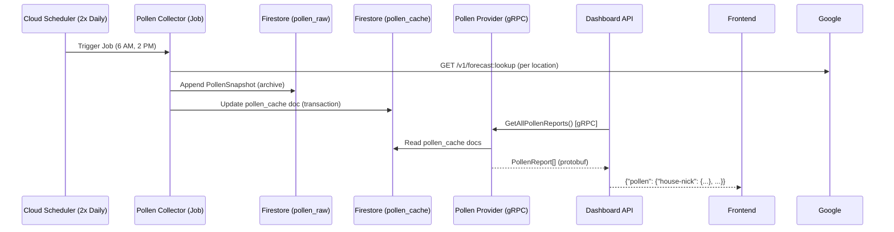

# Pollen Provider Architecture

## 1. Overview
The **Pollen Provider** is a microservice subsystem responsible for collecting and serving daily pollen count and allergy risk data. It follows the same architectural pattern as the Weather subsystem (Collector + Provider) but operates on a lower frequency (twice daily vs. hourly).

## 2. Requirements

### Functional Requirements
*   **Collection:** Fetch pollen data from the **Google Pollen API** twice per day for all 3 locations.
*   **Storage:** Dual-write to Firestore: `pollen_raw` (archive) and `pollen_cache` (hot cache).
*   **Serving:** Expose the latest pollen data via gRPC (`PollenService`) for the Dashboard API.
*   **Data Depth:** Store all 3 pollen types (Tree, Grass, Weed) and all plant-level UPI values. No health recommendations or plant descriptions.
*   **Overall Summary:** Collector computes the dominant pollen type and highest UPI at write time.

### Non-Functional Requirements
*   **Latency:** Provider reads from `pollen_cache` — single Firestore document read (<100ms).
*   **Cost:** Google Pollen API provides 5,000 free requests/month, then $10 per 1,000 after that. At 6 calls/day (3 locations × 2 runs) = ~180/month, we use 3.6% of the free tier. **Expected cost: $0.**
*   **Statelessness:** Provider is horizontally scalable (Cloud Run).
*   **Testability:** Core logic unit-testable without live Firestore.

### Technical Constraints
*   **Frequency:** Twice daily (6:00 AM + 2:00 PM Central).
*   **Data Structure:** Pollen indices are discrete integers (Universal Pollen Index, 0–5 scale).
*   **API:** Google Pollen API (`pollen.googleapis.com/v1/forecast:lookup`). Reuses the existing `GOOGLE_MAPS_API_KEY`.

## 3. Architecture & Data Flow



## 4. Data Strategy (Firestore)

All pollen data lives in the existing **`weather-log`** database (same as weather collections).

### Collection 1: `pollen_raw` (The Archive)
*   **Purpose:** Append-only history. Every reading is preserved for future analysis (seasonal trends, BigQuery export).
*   **Write Frequency:** 1 document per location per collection run (6 docs/day total).
*   **Schema:** Flat `PollenSnapshot` documents.

### Collection 2: `pollen_cache` (The Dashboard View)
*   **Purpose:** Read-optimized view for the Provider. One document per location.
*   **History:** Rolling 14-day window (28 entries at 2 readings/day). Truncated by the collector at write time.
*   **Schema:**
    ```json
    {
      "last_updated": "timestamp",
      "current": {
        "location_id": "house-nick",
        "collected_at": "timestamp",
        "overall_index": 4,
        "overall_category": "High",
        "dominant_type": "TREE",
        "types": [
          {"code": "TREE", "index": 4, "category": "High", "in_season": true},
          {"code": "GRASS", "index": 1, "category": "Very Low", "in_season": false},
          {"code": "WEED", "index": 0, "category": "None", "in_season": false}
        ],
        "plants": [
          {"code": "JUNIPER", "display_name": "Juniper", "index": 4, "category": "High", "in_season": true},
          {"code": "OAK", "display_name": "Oak", "index": 0, "category": "None", "in_season": false}
        ]
      },
      "history": [
        // Last 28 PollenSnapshot objects (14 days × 2/day)
      ]
    }
    ```

## 5. Implementation Strategy

### Components

1.  **Pollen Collector (`services/pollen-collector`)**
    *   **Role:** Background Worker (Writer).
    *   **Runtime:** Cloud Run Job.
    *   **Trigger:** Cloud Scheduler (`0 6,14 * * *` — 6 AM + 2 PM Central).
    *   **Structure:** Single-file `main.go` (matches weather-collector pattern).
    *   **Responsibilities:**
        *   Fetch pollen data from Google Pollen API with retry (3 attempts, exponential backoff).
        *   Map API response to internal storage models.
        *   Compute overall summary (highest UPI across Tree/Grass/Weed).
        *   Dual-write to `pollen_raw` and `pollen_cache`.
        *   Truncate cache history to 28 entries.

2.  **Pollen Provider (`services/pollen-provider`)**
    *   **Role:** API Service (Reader).
    *   **Runtime:** Cloud Run Service (gRPC, port 50052).
    *   **Architecture:** Standard Layered (Transport → Service → Repository).
    *   **Folder Structure:**
        ```text
        services/pollen-provider/
        ├── cmd/server/main.go        # Entry point, graceful shutdown, health checks
        ├── internal/
        │   ├── gen/go/               # Generated gRPC stubs (Buf)
        │   ├── repository/
        │   │   ├── firestore.go      # Reads from pollen_cache
        │   │   └── reader.go         # PollenReader interface
        │   ├── service/
        │   │   ├── pollen.go         # Business logic
        │   │   └── pollen_test.go    # Tests with MockRepository
        │   └── transport/
        │       ├── handler.go        # gRPC handler + proto mapping
        │       └── handler_test.go   # Handler tests
        ├── buf.gen.yaml
        ├── go.mod
        └── Dockerfile
        ```

### gRPC Contract

Proto definition: `services/protos/pollen-provider/v1/pollen_provider.proto`

```protobuf
service PollenService {
  rpc GetAllPollenReports(GetAllPollenReportsRequest) returns (GetAllPollenReportsResponse);
  rpc GetPollenReport(GetPollenReportRequest) returns (GetPollenReportResponse);
}

message PollenReport {
  string location_id = 1;
  google.protobuf.Timestamp collected_at = 2;
  int32 overall_index = 3;        // 0-5 UPI (highest across types)
  string overall_category = 4;    // "Low", "High", etc.
  string dominant_type = 5;       // "TREE", "GRASS", or "WEED"
  repeated PollenType types = 6;
  repeated PollenPlant plants = 7;
}

message PollenType {
  string code = 1;        // TREE, GRASS, WEED
  int32 index = 2;        // 0-5 UPI
  string category = 3;
  bool in_season = 4;
}

message PollenPlant {
  string code = 1;        // JUNIPER, OAK, RAGWEED, etc.
  string display_name = 2;
  int32 index = 3;        // 0-5 UPI
  string category = 4;
  bool in_season = 5;
}
```

### Dashboard API Integration
*   **Client:** New `pollen-client.go` in `services/dashboard-api/internal/clients/`.
*   **Aggregation:** `GetDashboard` handler fetches weather and pollen in parallel via `errgroup`.
*   **Response:** Pollen data appears under a `"pollen"` key alongside `"pressure"`:
    ```json
    {
      "pressure": { "house-nick": {...} },
      "pollen":   { "house-nick": {...} }
    }
    ```

### Shared Module (`services/shared/`)

Cross-cutting concerns live in a local Go module with **zero external dependencies** (stdlib only). Each service imports it via a `replace` directive in `go.mod`.

```text
services/shared/
├── go.mod           # module github.com/.../services/shared (stdlib only)
├── locations.go     # Location struct + Locations slice (single source of truth)
├── constants.go     # DatabaseID, WeatherCacheCollection, PollenCacheCollection
└── logging.go       # InitLogging() — slog JSON handler with DEBUG toggle
```

**What stays in each service (by design):**
*   Retry logic — local to each collector (see [Issue #25](https://github.com/nickfang/personal-dashboard/issues/25) for future generic extraction).
*   gRPC client TLS/auth — only exists in dashboard-api, pulls heavy gRPC deps.
*   Domain models, proto stubs, Firestore schemas — each service owns its own internal types.
*   `_raw` collection names — only used by their respective collector.

### Dependency Management
*   **Contract First:** Managed via Buf in `services/protos`.
*   **Distributed Generation:** Each service (pollen-provider, dashboard-api) generates its own copy of gRPC stubs into `internal/gen/go`.
*   **Build Strategy:** Docker builds use `services/` as the build context (not individual service dirs) so the shared module is available during `go mod tidy`.

### Locations
All 3 locations are fetched separately (4–6 km apart, different 1km grid cells):
*   `house-nick` (Lat: 30.2605, Long: -97.6677)
*   `house-nita` (Lat: 30.2942, Long: -97.6959)
*   `distribution-hall` (Lat: 30.2619, Long: -97.7282)

## 6. Infrastructure (Terraform)

### Pollen Collector (`infra/pollen_collector.tf`)
*   **Service Account:** `pollen-collector-sa` with `roles/datastore.user` (Firestore write).
*   **Secret Access:** IAM binding to the existing `google-maps-api-key` secret (shared with weather-collector).
*   **Cloud Run Job:** `pollen-collector-job`.
*   **Cloud Scheduler:** `trigger-pollen-collector` — cron `0 6,14 * * *` (America/Chicago).

### Pollen Provider (`infra/pollen_provider.tf`)
*   **Service Account:** `pollen-provider-sa` with `roles/datastore.viewer` (Firestore read-only).
*   **Cloud Run Service:** `pollen-provider-service` — gRPC, port 50052, HTTP/2 (`h2c`).
*   **Private Ingress:** Internal traffic only (called by Dashboard API).

### Dashboard API Updates (`infra/dashboard_api.tf`)
*   **IAM:** Dashboard API service account granted `roles/run.invoker` on pollen-provider.
*   **Env Var:** `POLLEN_PROVIDER_ADDR` pointing to the pollen-provider Cloud Run URL.

### Bootstrap Strategy
Same "Bootstrap + CD" pattern as weather services: Terraform creates the initial image via `gcloud builds submit`, then `lifecycle { ignore_changes }` allows GitHub Actions to manage day-to-day deployments.

## 7. Continuous Deployment (GitHub Actions)

Four new workflow files (all include `services/shared/**` in path triggers so shared module changes rebuild downstream services):
*   `.github/workflows/verify-pollen-collector.yml` — PR checks (test + build).
*   `.github/workflows/deploy-pollen-collector.yml` — Deploys on push to `main` (paths: `services/pollen-collector/**`, `services/shared/**`). Uses `gcloud run jobs update`.
*   `.github/workflows/verify-pollen-provider.yml` — PR checks (test + build).
*   `.github/workflows/deploy-pollen-provider.yml` — Deploys on push to `main` (paths: `services/pollen-provider/**`, `services/shared/**`). Uses `gcloud run services update`.

## 8. Decision Log

### ADR-001: External API — Google Pollen API
*   **Decision:** Use the Google Pollen API (`pollen.googleapis.com/v1/forecast:lookup`).
*   **Alternatives Considered:**
    *   **AccuWeather Pollen API** — Provides daily counts by category (Tree/Ragweed/Mold/Grass). Rejected: requires a separate API key, a new vendor account, and a separate billing relationship. Free tier has limited calls.
    *   **Ambee Pollen API** — REST-based with species-level data. Rejected: new vendor dependency, unclear mold support, additional secret management.
*   **Rationale:** Reuses the existing `GOOGLE_MAPS_API_KEY` already in Secret Manager. Same GCP billing account. No new vendor onboarding. Provides the richest plant-level detail (15 species including Juniper/Cedar — critical for Austin allergy monitoring). Pricing: 5,000 free requests/month, then $10/1000 after that. At ~180 calls/month we stay well within the free tier ($0 cost).

### ADR-002: Mold Data — Deferred
*   **Decision:** Do not include mold spore data in this implementation.
*   **Alternatives Considered:**
    *   **Tomorrow.io** — Describes indices as "pollen or mold spores" but data is blended into tree/grass/weed indices, not a standalone mold count. Would require a new vendor + API key.
    *   **Ambee** — Has pollen data but no clearly documented standalone mold endpoint.
    *   **National Allergy Bureau (NAB)** — Gold standard for mold spore counts, but it's a lab-based reporting system (microscope analysis of air samples), not a public REST API.
*   **Rationale:** No clean, standalone mold spore REST API exists that meets our quality bar. Mold is deferred as a future enhancement if a suitable API emerges.

### ADR-003: Data Depth — Types + All Plant UPIs
*   **Decision:** Store all 3 pollen types (Tree/Grass/Weed) with UPI values AND all plant-level UPI values. No health recommendations or plant descriptions.
*   **Alternatives Considered:**
    *   **Type-level summary only** — Only the 3 types, no per-plant data. Rejected: loses the Juniper/Cedar visibility that was a core requirement.
    *   **Full detail (types + plants + health recs + descriptions)** — Maximum data. Rejected: health recommendations and plant descriptions are static text that changes rarely, bloats Firestore documents, and is unlikely to be displayed.
*   **Rationale:** Types + plants gives us the Cedar/Juniper data we need while keeping documents compact. The UPI integer values are the actionable data; prose descriptions are not.

### ADR-004: Fetch Strategy — Background Collector (2x/day)
*   **Decision:** Use a background Cloud Run Job triggered by Cloud Scheduler at 6:00 AM and 2:00 PM Central.
*   **Alternatives Considered:**
    *   **Live API call from pollen-provider** — No collector, call the Google Pollen API on each dashboard request, cache in-memory with a TTL. Rejected: adds 200-500ms latency to every dashboard load, unpredictable API costs (scales with dashboard traffic), and if the Pollen API is down the dashboard has no fallback data.
    *   **Collector 1x/day** — Single run at 6:00 AM. Rejected: no mid-day revision catch, no retry opportunity until next day if the run fails.
*   **Rationale:** Pollen data only meaningfully changes once a day (daily forecast). 2x/day captures the morning forecast + any afternoon revision. Cost is predictable: 3 locations × 2 runs = 6 API calls/day (~180/month, 3.6% of free tier). Dashboard reads hit Firestore, not the external API — fast, reliable, and decoupled from Google Pollen API availability.

### ADR-005: Overall Summary — Computed at Write Time
*   **Decision:** The collector computes `overallIndex`, `overallCategory`, and `dominantType` (highest UPI across Tree/Grass/Weed) at write time and stores them as top-level fields.
*   **Alternatives Considered:**
    *   **Compute at read time** — Store only raw type/plant data. The pollen-provider or dashboard-api scans the 3 types to find the max on each request. Rejected: unnecessary repeated computation. With 3 types this is trivial, but the principle matters — the collector already has all the data in hand.
*   **Rationale:** Mirrors how `weather-collector` computes `PressureStats.Trend` at write time rather than deferring it to every read. The dashboard API reads one field instead of scanning arrays.

### ADR-006: Firestore Strategy — Dual-Write
*   **Decision:** Write to both `pollen_raw` (archive) and `pollen_cache` (hot cache) on every collection run.
*   **Alternatives Considered:**
    *   **Single collection (`pollen_cache` only)** — The cache doc IS the archive. At 2 readings/day, even years of data fit in a single Firestore doc. Rejected: mixing archive concerns into the serving document. The cache doc should be optimized for reads (small, fast). The raw collection should be optimized for exports (flat, append-only).
    *   **Single collection (`pollen_history`, one doc per day)** — Date-keyed documents. Rejected: diverges from the weather subsystem pattern without a compelling reason. Adds query complexity for the provider.
*   **Rationale:** Consistent with the weather subsystem's dual-write strategy. `pollen_raw` is a flat, append-only archive for BigQuery export and seasonal analysis. `pollen_cache` is a read-optimized single-doc-per-location view for the dashboard.

### ADR-007: Firestore Database — Reuse `weather-log`
*   **Decision:** Pollen collections live in the existing `weather-log` database alongside weather collections.
*   **Alternatives Considered:**
    *   **New database (`dashboard-data`)** — Cleaner name. Rejected: requires a new Terraform resource, new IAM bindings, and either migrating weather data or having services connect to two different databases. The name `weather-log` is a legacy artifact — it's functionally the "dashboard data" database.
*   **Rationale:** Simpler. No new Terraform resources, same client connection, same service account permissions. The database already exists and is in production.

### ADR-008: Cache History Depth — 14 Days
*   **Decision:** The `pollen_cache` history array keeps a rolling 14-day window (28 entries at 2 readings/day).
*   **Alternatives Considered:**
    *   **No truncation (keep everything)** — At 2 readings/day, even a year (~730 entries) is well under Firestore's 1MB doc limit. Rejected: the cache doc is for fast dashboard reads, not archival. Unbounded growth means unbounded read sizes over time.
    *   **7 days** — Sufficient for a week view. Rejected: two weeks gives more trend visibility for seasonal ramp-ups.
    *   **30 days / 90 days** — More history. Rejected: diminishing returns for a cache doc when `pollen_raw` already archives everything.
*   **Rationale:** 14 days covers two full weeks — enough for the dashboard to show a meaningful pollen trend. Full history is always available in `pollen_raw` for deeper analysis.

### ADR-009: Service Architecture — Standalone Pollen Provider
*   **Decision:** `pollen-provider` is a standalone gRPC service with its own binary, port (50052), Cloud Run service, and service account.
*   **Alternatives Considered:**
    *   **Extend weather-provider** — Add pollen RPCs to the existing weather-provider gRPC server. Rejected: couples pollen + weather deployment cycles, mixes domains in one binary, and contradicts the architecture's separation-of-concerns rationale.
    *   **Combined "data-provider"** — Rename weather-provider to data-provider and add pollen RPCs alongside weather RPCs. Rejected: requires renaming an existing production service, updating Terraform, Dashboard API client, and CI/CD. Larger refactor with no immediate benefit.
*   **Rationale:** Independent deployment cycles and failure isolation. A pollen-provider bug doesn't take down weather data. This architecture is also designed for practicing microservices patterns. Additionally, a standalone service supports a future dedicated pollen API endpoint.

### ADR-010: Locations — All 3 Fetched Separately
*   **Decision:** Fetch pollen data for each of the 3 locations using its own coordinates.
*   **Alternatives Considered:**
    *   **1 fetch, store for all 3** — Make 1 API call and copy the result to all 3 `pollen_cache` docs. Rejected: the locations are 4–6 km apart (not within 1km as initially assumed). At the API's 1km grid resolution, they fall in different cells and could return different data due to local tree cover variation.
    *   **1 location only** — Fetch for a single representative location. Rejected: loses per-location data and creates an inconsistency with the weather subsystem which fetches all 3.
*   **Rationale:** 6 API calls/day (3 locations × 2 runs) is still only ~180/month — well within the 5,000 free tier. Maintaining per-location data is consistent with the weather subsystem and preserves any real variation between locations.

### ADR-011: Dashboard API Response — Separate "pollen" Key
*   **Decision:** Pollen data appears under a `"pollen"` key alongside `"pressure"` in the JSON response, using the same per-location map pattern.
*   **Alternatives Considered:**
    *   **Location-first nesting** — `{"house-nick": {"pressure": {...}, "pollen": {...}}}`. Rejected: requires a breaking change to the existing pressure response format. The current domain-first structure is already consumed by the frontend.
*   **Rationale:** Consistent with the existing response pattern. The frontend knows where to find each domain. `errgroup` makes the parallel fetch straightforward.

### ADR-012: Infrastructure — Separate Cloud Run Job
*   **Decision:** Pollen collector runs as its own Cloud Run Job (`pollen-collector-job`) with its own Cloud Scheduler trigger.
*   **Alternatives Considered:**
    *   **Combined collector job** — Add pollen fetching logic to the existing weather-collector binary. Rejected: couples two different schedules (hourly weather vs 2x/day pollen), mixes failure modes (weather API down ≠ pollen API down), and makes the single binary responsible for two unrelated domains.
*   **Rationale:** Independent failure isolation. If the Google Pollen API has an outage, weather collection continues unaffected. Each job has its own service account with only the permissions it needs.

### ADR-013: Naming Convention
*   **Decision:** `pollen-provider` and `pollen-collector`.
*   **Rationale:** Aligns with `weather-provider` and `weather-collector`. The `-provider` suffix indicates a read-only gRPC service. The `-collector` suffix indicates a write-heavy background job.

### ADR-014: Shared Module — Local `go.work` Module
*   **Decision:** Create `services/shared/` as a local Go module (stdlib-only) containing locations, constants (database ID, cache collection names), and logging setup. Each service references it via a `replace` directive. Retry logic is excluded for now (see [Issue #25](https://github.com/nickfang/personal-dashboard/issues/25)).
*   **Alternatives Considered:**
    *   **Published Go module** — Push `services/shared` to a Go module proxy (or use the GitHub repo path). Rejected: adds a publish/version/tag workflow for code that only this repo consumes. Overengineered for an internal monorepo.
    *   **Code generation (`make setup`)** — A Makefile target copies shared files into each service at build time. Rejected: generated files drift if someone edits a copy directly, requires discipline to never modify the output, and `go.work` is the idiomatic Go solution for this exact problem.
    *   **No shared module (keep duplicating)** — Each service defines its own locations, constants, and logging. Rejected: locations and database ID fall in the "dangerous duplication" category — a typo or drift causes silent failures (e.g., collector writes to one collection name, provider reads from another).
*   **Rationale:** `go.work` is the idiomatic Go monorepo pattern. Zero-dependency shared module keeps the dependency graph clean (only consumers pull in gRPC, Firestore, etc.). Validated against three growth scenarios: (1) adding more data providers — shared locations and constants scale to N services, (2) multi-region/dynamic locations — single place to update, (3) shared infrastructure (auth, observability) — the module is already in place to absorb new cross-cutting concerns. Docker builds expand context from service dir to `services/` so the shared module is available during `go mod tidy`.
