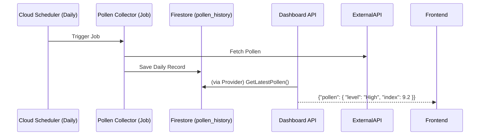

# Pollen Service Architecture (Future)

## 1. Overview
The **Pollen Service** is a planned microservice responsible for collecting and serving daily pollen count and allergy risk data. It follows the same architectural pattern as the Weather Collector but operates on a much lower frequency (daily vs. hourly).

## 2. Requirements

### Functional Requirements
*   **Collection:** Fetch pollen data from external APIs (e.g., AccuWeather, Pollen.com) once per day.
*   **Storage:** Store historical pollen counts in Firestore.
*   **Serving:** Expose the latest pollen data via gRPC for the Dashboard API.

### Technical Constraints
*   **Frequency:** Daily execution (e.g., 6:00 AM local time).
*   **Data Structure:** Unlike pressure (continuous), pollen is discrete (Low, Med, High) or numeric index.

## 3. Architecture & Data Flow

## 4. Implementation Strategy

### Components
1.  **Pollen Collector (Job):**
    *   A Go binary running in Cloud Run (Job).
    *   Triggered by Cloud Scheduler.
    *   Responsible for fetching and normalizing external data.

2.  **Pollen Provider (Server) [Optional]:**
    *   Could be a separate gRPC service if logic is complex.
    *   **Alternative:** The existing `weather-provider` could be extended to serve pollen data if the domain overlaps significantly (both are "environmental conditions").

### Infrastructure Changes
*   **Terraform:**
    *   New `google_cloud_scheduler_job` resource for daily execution.
    *   New `google_cloud_run_v2_job` resource for the collector container.
    *   IAM roles for the new service account.

## 5. Decision Log
*   **Why separate from Weather Collector?**
    *   Different frequency (Daily vs Hourly).
    *   Different failure modes (Pollen API might be down while Weather is up).
    *   Separation of Concerns: Maintain modularity for easier debugging.
