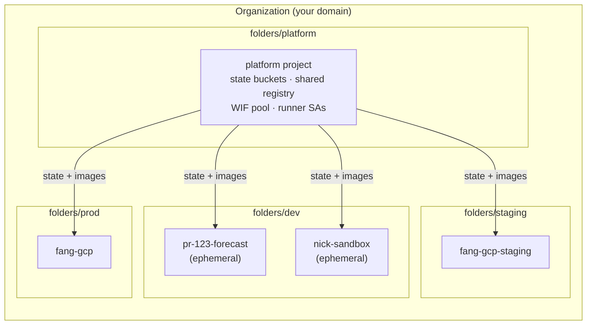

# Platform Engineering Migration

A tutorial for rebuilding `infra/` from hand-run Terraform into a platform-engineering setup:
isolated environments, on-demand partial deploys, and pipelines that run themselves.

Work through the phases in order. Each one ends with a **verification gate** — a command whose
output tells you whether to continue. Don't skip a gate. Several phases are hard to unwind, and the
gate is what catches a mistake while it's still cheap.

## 1. Where you are now

```
infra/
  staging/     # terraform.tfstate on your laptop
  prod/        # terraform.tfstate on your laptop
  modules/     # 7 modules, shared by both
```

`infra/staging/main.tf` and `infra/prod/main.tf` are byte-identical except for three
`sa_display_name` capitalizations and a `dashboard_api_domain` module staging has and prod doesn't.
That's not a design decision — it's the drift two hand-maintained copies always produce. Terraform
runs by hand, from one laptop, against local state.

## 2. Where you're going



| Tier | Shape | Who gets in |
|---|---|---|
| **dev** | ephemeral, only the components you're working on | the engineer who created it |
| **staging** | full deploy | developers + stakeholders (read) |
| **prod** | full deploy | almost nobody; service accounts do the work |

What actually differs between them is more than instance size — and cheaper than you might expect,
because every tier scales to zero:

| Concern | dev | staging | prod |
|---|---|---|---|
| **Scheduler cadence** | cron set, **paused** | daily | natural (hourly / 2× / 6h) |
| `max_instances` (spend cap) | 1 | 3 | 10 |
| `min_instances` | 0 | 0 | 0 |
| Firestore PITR | off | off | on |
| Firestore deletion | `DELETE` | `DELETE` | `ABANDON` + protected |
| Public invoker | owner only | `allUsers` | `allUsers` |
| Image tag | branch SHA or seed | `latest` | pinned SHA, enforced |
| Human access | creator | `gcp-staging-viewers` | `gcp-prod-oncall`, read-only |

Two things to notice, because they're the ones people get backwards.

**`min_instances` is 0 in prod too.** Always-warm instances are the largest Cloud Run cost and cold
starts here are tolerable. The point isn't that prod is warm — it's that the knob exists and each
tier sets it on purpose. If the dashboard ever needs a warm aggregator it's one line in
`envs/prod.tfvars`, applied to that one component, and you'll know what it costs.

**The dominant cost is the scheduler, not Cloud Run.** Three collectors on crons, each run hitting
the Google Maps API. Staging copying prod's cadence burns the same API quota for data nobody reads,
and an ephemeral environment with live schedulers starts billing the moment it exists. `paused` in
`envs/dev.tfvars` is the single most valuable line in this tutorial.

```
infra/
  bootstrap/    # org-level: folders, org policies.  Run rarely, by a human.
  platform/     # state buckets, shared registry, WIF, runner SAs.
  stacks/
    foundation/   # per-env: APIs, Firestore, secrets, human IAM
    collector/    # one instance per collector
    provider/     # one instance per provider
    aggregator/   # reads provider outputs via remote state
  envs/         # <env>.tfvars + <env>.gcs.tfbackend
  modules/      # existing modules, revised
  bin/          # self-service: env-create, env-destroy, deploy-component
```

## 3. Three findings that drive the whole design

Read this section before writing any code. Everything downstream follows from it, and the phases
will look arbitrary if you skip it.

### 3.1 Partial deploys need decomposed state

You want to deploy *just* the forecast collector for a dev environment. Today you can't. The graph
is 200 lines of root HCL where every module carries `depends_on = [module.foundation]`, held in one
state file. There's no way to apply a piece of it.

`terraform apply -target=module.forecast_collector` looks like the answer. It isn't — Terraform's
own documentation describes `-target` as a tool for recovering from mistakes, not a workflow. It
skips dependency resolution, so it silently produces plans that don't reflect the real graph.

The actual answer is **layered stacks**: `foundation` applied once per environment, then component
stacks that each hold their own state and read foundation's outputs. And here's the connection that
makes the ordering of this tutorial make sense — **layers read each other's outputs through remote
state**. So the state bucket isn't hygiene you do first because it's tidy. It's the substrate that
makes decomposition possible at all. That's Phase 1, and everything else waits on it.

### 3.2 The GCP project is your isolation boundary

You said environment isolation is a security requirement. Look at what the modules grant today:

```hcl
# infra/modules/cloud-run-job/main.tf:6-16
resource "google_project_iam_member" "firestore_writer" {
  project = var.project_id
  role    = "roles/datastore.user"        # <-- project-wide
  member  = "serviceAccount:${google_service_account.sa.email}"
}

resource "google_project_iam_member" "run_invoker" {
  project = var.project_id
  role    = "roles/run.invoker"           # <-- project-wide
  member  = "serviceAccount:${google_service_account.sa.email}"
}
```

`infra/modules/cloud-run-provider/main.tf` does the same with `roles/datastore.viewer`. These are
project-level grants. Any two things sharing a project can reach each other's Firestore databases
and invoke each other's services, **no matter what you name them**.

That's why this tutorial uses one project per environment. It's tempting to put ephemeral dev
environments in a shared project with name prefixes like `pr123-forecast-collector`. Prefixing is
namespacing, and namespacing is cosmetic from a security standpoint. To make a shared project a
real boundary you'd have to convert every project-level grant to a resource-scoped one — more code
than the project-per-environment approach, for a weaker result.

The payoff: **because each environment is its own project, every resource name stays exactly as it
is today.** No `name_prefix` threading through seven modules. The project boundary does that work.

### 3.3 Almost nothing is expressible per tier yet

None of the differences in the table above can be configured today.

There is no `resources` block and no `scaling` block anywhere in `cloud-run-job`,
`cloud-run-provider`, or `cloud-run-aggregator` — every service runs on GCP defaults, and no module
accepts CPU, memory, `min_instance_count`, or `max_instance_count`.

Six more values are hardcoded where they should be inputs:

| Hardcoded | Where | Should vary because |
|---|---|---|
| `ingress = "INGRESS_TRAFFIC_ALL"` | `cloud-run-aggregator/main.tf:20` | a dev env shouldn't be on the public internet |
| `member = "allUsers"` | `cloud-run-aggregator/main.tf:59` | same |
| `time_zone`, `attempt_deadline` | `cloud-run-job/main.tf:87-88` | tier-specific scheduling |
| `location_id`, `type` | `firestore/main.tf:6-7` | prod may want multi-region durability |

And the firestore module sets no `deletion_policy` at all, which is why `terraform destroy` on a
populated database fails — that breaks both the staging rebuild and the ephemeral-environment
reaper. Phase 3 turns all of these into per-tier inputs.

## 4. Two decisions worth understanding before you start

### 4.1 tfvars go in git

The instinct is that tfvars are secret and belong in Secret Manager. Look at what's actually in
them: `project_id`, `region`, `github_repository`, `api_domain`. Those are identifiers, not
credentials — and they're already in `docs/DISASTER_RECOVERY.md` and in your GitHub environment
variables. Committing them makes plans reproducible and config changes reviewable in a PR.

Your real secret handling is already right, and doesn't change:

```hcl
# infra/modules/secrets/main.tf
resource "google_secret_manager_secret_version" "placeholder" {
  secret_data = "REPLACE_ME"
  lifecycle { ignore_changes = [secret_data] }
}
```

Terraform creates an empty container; you add the real value out-of-band with
`gcloud secrets versions add`; Terraform never sees it. Keep that. There's a second reason beyond
convention: **anything Terraform reads gets written to state in plaintext.** Routing a secret
through a variable to "keep it safe" puts it in the state bucket. Don't.

### 4.2 Terraform stops building images

All three compute modules do this:

```hcl
# infra/modules/cloud-run-job/main.tf:25-34
resource "null_resource" "bootstrap" {
  provisioner "local-exec" {
    command = "gcloud builds submit ${var.services_path} ..."
  }
}
```

It has no `triggers`, so it fires exactly once per state and never again. It needs `gcloud`
installed and the `services/` source tree on disk at `../../services`, which only resolves when
Terraform's working directory is `infra/staging` or `infra/prod`. And it means creating
infrastructure requires building containers — so an ephemeral environment would pay a full build
before it could exist.

Phase 3 replaces it with an `image` variable. The `ignore_changes` on the image field is already
there, so CD keeps owning the tag exactly as it does now. Ephemeral environments then reference an
existing tag in the shared registry and spin up in seconds — or fall back to a placeholder image
when nothing has been built yet, so a brand-new environment still comes up.

### 4.3 The deploy identity has to move before the old roots are deleted

`module.github_oidc` in the current roots creates `github-actions-sa` — the identity your twelve
deploy workflows authenticate as. Phase 3 deletes those roots. Phase 1 therefore builds the
replacement (`deployer-<tier>`) *first*, and you repoint the GitHub variables and confirm a green
deploy before anything is torn down.

This ordering isn't optional: `google_iam_workload_identity_pool` soft-deletes for 30 days while
holding its ID, so if you delete `github-actions-pool` before the replacement works, there's no
quick way back.

## 5. Phases

| Phase | Doc | What it does | Reversible? |
|---|---|---|---|
| 0 | [00-organization.md](00-organization.md) | Cloud Identity, org, folders, groups, migrate your 8 projects | Hard — do it deliberately |
| 1 | [01-bootstrap-and-platform.md](01-bootstrap-and-platform.md) | State buckets, shared registry, WIF, runner SAs | Yes |
| 2 | [02-state-migration.md](02-state-migration.md) | Move staging + prod state into GCS | Yes, keep local backups |
| 3 | [03-stacks.md](03-stacks.md) | Decompose into stacks; add sizing; drop the build | Yes, but needs `state mv` |
| 4 | [04-ephemeral-envs.md](04-ephemeral-envs.md) | Project factory + self-service scripts | Yes |
| 5 | [05-terraform-ci.md](05-terraform-ci.md) | plan on PR, apply on merge, prod behind approval | Yes |

Phase 0 is entirely console and domain-admin work — there's no Terraform in it. Everything from
Phase 1 on is code.

**You can stop after Phase 2 and still be better off**: state in a bucket, locking, and CI able to
run Terraform at all. Phases 3–5 are what buy you the platform.

## 6. Prerequisites

- A domain you own — you already have one, since `infra/modules/cloud-run-domain-mapping` and
  staging's `api_domain` variable depend on it
- `gcloud` authenticated as the account that owns your 8 projects
- Terraform ≥ 1.13 (you have 1.15.8; `terraform version` to confirm)
- Billing account with permission to link new projects
- Your existing `infra/staging/terraform.tfstate` and `infra/prod/terraform.tfstate` intact —
  Phase 2 migrates them, and a lost state file means importing every resource by hand

## 7. Open questions to settle as you go

- **Which of your 8 projects are still live?** Phase 0 migrates them into the org. Delete the dead
  ones first — it's much easier before the move, and it frees quota.
- **Should prod get a domain mapping?** Staging has `module.dashboard_api_domain`; prod has no
  `api_domain` variable at all. Phase 3 is where you'd add it.
- **`docs/DISASTER_RECOVERY.md` needs rewriting.** It currently says state is local and *"the
  rebuild-from-scratch DR principle means we don't need remote state."* Phase 2 reverses that. The
  runbook needs a bucket-recovery path instead, and it's worth noting that WIF pools soft-delete
  for 30 days, so rebuild-from-scratch was never as clean as it sounds.
